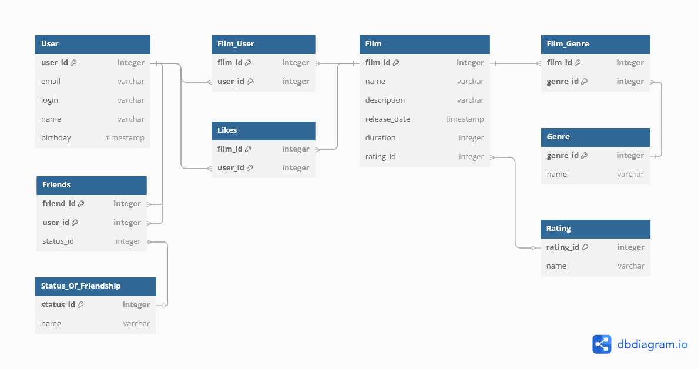

# Filmorate

**Filmorate** - Spring Boot приложение для поиска и оценки фильмов.

## ER-диаграмма

[Функционал](#функционал) | [Примеры SQL-запросов для модели User](#примеры-sql-запросов-для-модели-user) |
[Примеры SQL-запросов для модели Film](#примеры-sql-запросов-для-модели-film)



## Функционал

- **User:** информация о пользователях.

- **Friends:** информация о дружбе между пользователями.

- **Status_Of_Friendship:** соединительная таблица, связывающая пользователей с их статусами дружбы.

- **Film:** данные о фильмах.

- **Rating:** рейтинг фильмов.

- **Genre:** жанры фильмов.

- **Film_Genre:** соединительная таблица, связывающая фильмы с жанрами.

- **Film_User:** соединительная таблица, связывающая пользователей с фильмами.

- **Likes:** лайки пользователей.


## Примеры SQL-запросов для модели User

### 1. Создание пользователя

```
INSERT INTO User (email, 
                  login, 
                  name, 
                  birthday)
VALUES (?, ?, ?, ?);
```

### 2. Обновление данных пользователя

```
UPDATE User 
SET email =  ?, 
    login = ?, 
    name = ?, 
    birthday = ?
WHERE user_id = ?;
```

### 3. Получение всех пользователей

```
SELECT * FROM User;
```

### 4. Получение пользователя по id

```
SELECT u.*
FROM User As u
WHERE u.user_id = ?;
```

### 5. Добавление друзей

```
INSERT INTO Friends (user_id,
                     friend_id,
                     status_id)
VALUES (?, ?, ?);
```

### 6. Удаление друзей

```
DELETE FROM Friends 
WHERE user_id = ? AND friend_id = ?;
```

### 7. Получение друзей пользователя

```
SELECT u.*
FROM User AS u
JOIN Friends AS f ON u.user_id = f.user_id OR u.user_id = f.friend_id
WHERE (f.user_id = ? OR f.friend_id = ?) AND u.user_id != ?;
```

### 8. Получение общих друзей

```
SELECT u.* FROM User AS u
JOIN Friends f1 ON u.user_id = f1.friend_id
JOIN Friends f2 ON u.user_id = f2.friend_id
WHERE f1.user_id = ? AND f2.user_id = ?;
```


## Примеры SQL-запросов для модели Film

### 1. Создание фильма

```
INSERT INTO Film (name, 
                  description, 
                  release_date, 
                  duration,
                  rating_id)
VALUES (?, ?, ?, ?, ?);
```

### 2. Обновление фильма

```
UPDATE Film 
SET name =  ?, 
    description = ?, 
    release_date = ?, 
    duration = ?,
    rating_id = ?
WHERE film_id = ?;
```

### 3. Получение всех фильмов

```
SELECT f.film_id,
       f.name AS title,
       f.description,
       f.release_date,
       f.duration,
       r.name AS MPA_RATING
FROM Film AS f
LEFT JOIN Rating AS r ON f.rating_id = r.rating_id;
```

### 4. Добавление лайка

```
INSERT INTO Likes (film_id, user_id)
VALUES (?, ?);
```

### 5. Удаление лайка

```
DELETE FROM Likes
WHERE film_id = ? AND user_id = ?;
```

### 6. Получение самых популярных фильмов

```
SELECT f.film_id, 
       f.name, 
       f.description, 
       f.release_date, 
       f.duration, 
       f.rating_id,
       COUNT(l.user_id) AS like_count
FROM Film AS f
LEFT JOIN Likes AS l ON f.film_id = l.film_id
GROUP BY f.film_id, 
         f.name, 
         f.description, 
         f.release_date, 
         f.duration, 
         f.rating_id
ORDER BY like_count DESC
LIMIT ?;
```