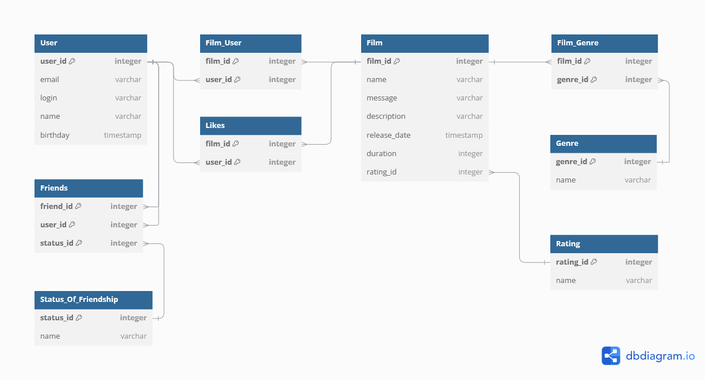

# Filmorate

**Filmorate** -  Spring Boot приложение для поиска и оценки фильмов.

## ER-диаграмма

[Функционал](#функционал) | [Примеры SQL-запросов для модели User](#примеры-sql-запросов-для-модели-user) | 
[Примеры SQL-запросов для модели Film](#примеры-sql-запросов-для-модели-film)



## Функционал

 -**User:** информация о пользователях.

 -**Friends:** информация о дружбе между пользователями.

 -**Status_Of_Friendship:** соединительная таблица, связывающая пользователей с их статусами дружбы.

 -**Film:** данные о фильмах.

 -**Rating:** рейтинг фильмов.

 -**Genre:** жанры фильмов.

 -**Film_Genre:** соединительная таблица, связывающая фильмы с жанрами.

 -**Film_User:** соединительная таблица, связывающая пользователей с фильмами.

- **Likes:** лайки пользователей.
 

## Примеры SQL-запросов для модели User 

### 1. Создание пользователя

```
INSERT INTO User (email, 
                  login, 
                  name, 
                  birthday)
VALUES (user.getEmail(), 
        user.getLogin(), 
        user.getName(), 
        user.getBirthday());
```

### 2. Обновление пользователя

```
UPDATE User 
SET email =  user.getEmail(), 
    login = user.getLogin(), 
    name = user.getName(), 
    birthday = user.getBirthday()
WHERE user_id = user.getId();
```

### 3. Получение пользователя по id

```
SELECT u.*
FROM User AS u
WHERE u.user_id = user_id;
```

### 4. Получение всех пользователей

```
SELECT * FROM User;
```

## Примеры SQL-запросов для модели Film

### 1. Создание фильма

```
INSERT INTO Film (name, 
                  description, 
                  releaseDate, 
                  duration,
                   rating)
VALUES (film.getName(), 
        film.getDescription(), 
        film.getReleaseDate(), 
        film.getDuration(), 
        film.getRating());
```

### 2. Обновление фильма

```
UPDATE Film 
SET name =  film.getName(), 
    description = film.getDescription(), 
    releaseDate = film.getReleaseDate(), 
    duration = film.getDuration(),
    rating = getRating()
WHERE id = film.getId();
```

### 3. Получение фильма по id

```
SELECT f.*
FROM Film AS f
WHERE f.film_id = filmId;
```

### 4. Получение всех фильмов

```
SELECT f.id
       f.name AS title,
       f.description,
       f.releaseDate,
       f.duration,
       f.rating AS MPA_RATING
FROM Film AS f
LEFT JOIN Rating AS r ON f.rating_id = r.rating_id;
```

### 5. Добавление лайка

```
INSERT INTO Film_User (film_id,
                       user_id)
VALUES (filmId, userId);
```

### 6. Удаление лайка

```
DELETE FROM Film_User
WHERE film_id = filmId AND user_id = userId;
```