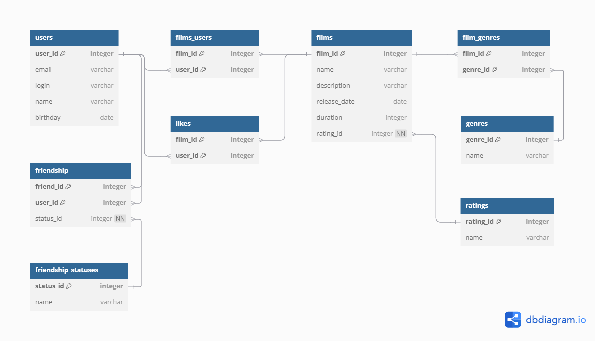

# Filmorate

**Filmorate** - Spring Boot приложение для поиска и оценки фильмов.

## Содержание

- [Технологии](#технологии)
- [Запуск проекта](#запуск-проекта)
- [ER-диаграмма](#er-диаграмма)
- [Функционал](#функционал)
- [Примеры SQL-запросов для модели User](#примеры-sql-запросов-для-модели-user)
- [Примеры SQL-запросов для модели Film](#примеры-sql-запросов-для-модели-film)

## Технологии

- Java 
- Spring Boot 
- Spring Data JDBC
- H2 Database
- REST
- Maven
- JUnit, AssertJ
- Lombok

## Запуск проекта

1. **Склонируйте репозиторий:**

   ```git clone https://github.com/megayashchik/java-filmorate.git```

2. **Перейдите в папку проекта:**

   ```cd java-filmorate```

3. **Запустите приложение:**

   ```mvn spring-boot:run```

4. **Откройте приложение в браузере:**

   ```http://localhost:8080```

## ER-диаграмма



## Функционал

## Users

- **users:** информация о пользователях.

- **friendships:** информация о дружбе между пользователями.

- **friendship_statuses:** соединительная таблица, связывающая пользователей с их статусами дружбы.

## Films

- **films:** данные о фильмах.

- **ratings:** рейтинг фильмов.

- **genres:** жанры фильмов.

- **film_genres:** соединительная таблица, связывающая фильмы с жанрами.

- **films_users:** соединительная таблица, связывающая пользователей с фильмами.

- **likes:** лайки пользователей.


## Примеры SQL-запросов для модели User

### 1. Создание пользователя

```sql
INSERT INTO users (email, 
                   login, 
                   name, 
                   birthday)
VALUES (?, ?, ?, ?);
```

### 2. Обновление данных пользователя

```sql
UPDATE users 
SET email =  ?, 
    login = ?, 
    name = ?, 
    birthday = ?
WHERE user_id = ?;
```

### 3. Получение всех пользователей

```sql
SELECT * FROM users;
```

### 4. Получение пользователя по id

```sql
SELECT u.*
FROM users As u
WHERE u.user_id = ?;
```

### 5. Добавление друзей

```sql
INSERT INTO friendships (user_id,
                         friend_id,
                         status_id)
VALUES (?, ?, ?);
```

### 6. Удаление друзей

```sql
DELETE FROM friendships 
WHERE user_id = ? AND friend_id = ?;
```

### 7. Получение друзей пользователя

```sql
SELECT u.*
FROM users AS u
JOIN friendships AS f ON u.user_id = f.user_id OR u.user_id = f.friend_id
WHERE (f.user_id = ? OR f.friend_id = ?) AND u.user_id != ?;
```

### 8. Получение общих друзей

```sql
SELECT u.* FROM users AS u
JOIN friendships f1 ON u.user_id = f1.friend_id
JOIN friendships f2 ON u.user_id = f2.friend_id
WHERE f1.user_id = ? AND f2.user_id = ?;
```


## Примеры SQL-запросов для модели Film

### 1. Создание фильма

```sql
INSERT INTO films (name, 
                   description, 
                   release_date, 
                   duration,
                   rating_id)
VALUES (?, ?, ?, ?, ?);
```

### 2. Обновление фильма

```sql
UPDATE films 
SET name =  ?, 
    description = ?, 
    release_date = ?, 
    duration = ?,
    rating_id = ?
WHERE film_id = ?;
```

### 3. Получение всех фильмов

```sql
SELECT f.film_id,
       f.name AS title,
       f.description,
       f.release_date,
       f.duration,
       r.name AS MPA_RATING
FROM films AS f
LEFT JOIN ratings AS r ON f.rating_id = r.rating_id;
```

### 4. Добавление лайка

```sql
INSERT INTO likes (film_id, user_id)
VALUES (?, ?);
```

### 5. Удаление лайка

```sql
DELETE FROM likes
WHERE film_id = ? AND user_id = ?;
```

### 6. Получение самых популярных фильмов

```sql
SELECT f.film_id, 
       f.name, 
       f.description, 
       f.release_date, 
       f.duration, 
       f.rating_id,
       COUNT(l.user_id) AS like_count
FROM films AS f
LEFT JOIN likes AS l ON f.film_id = l.film_id
GROUP BY f.film_id, 
         f.name, 
         f.description, 
         f.release_date, 
         f.duration, 
         f.rating_id
ORDER BY like_count DESC
LIMIT ?;
```
